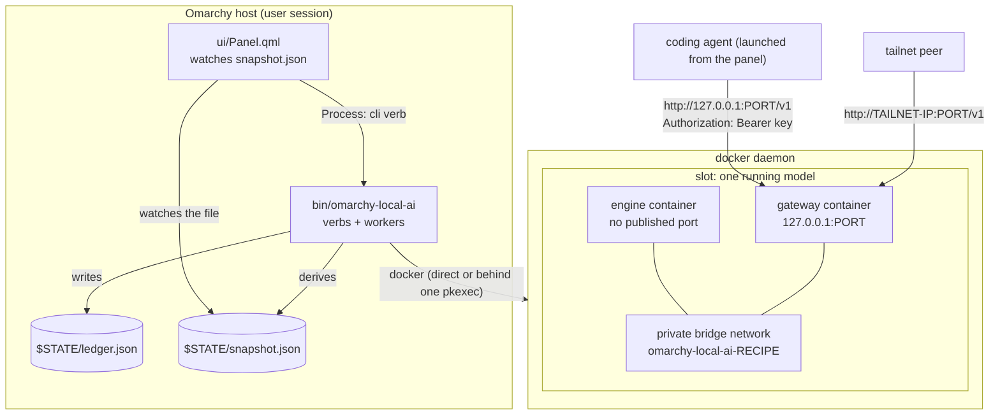

# 1 — Architecture

## Three parts, one job

| Part | Where | Role |
|---|---|---|
| **Registry** | `0xSero/local-ai-registry` | validates one recipe per hardware id on the exact card, then exports the file this plugin vendors as `recipes.json` |
| **Controller** | `bin/omarchy-local-ai` + `lib/*.sh` | turns a recipe into a running, verified pair of containers, and derives the state the panel reads |
| **Panel** | `ui/Panel.qml`, `ui/CardRow.qml`, `ui/Orb.qml`, `ui/ui.js` | renders the snapshot and issues verbs |

The registry is data; the plugin never runs anything from it that the gate has not re-checked.
`recipes.json` is the only interface between the two repositories, and CI fails if the file and the
registry commit it claims disagree.

## Topology



## The state machine of the whole plugin

```mermaid
stateDiagram-v2
  [*] --> idle
  idle --> download: load / run (weights absent)
  idle --> starting: load / run (weights present)
  download --> starting: weights verified
  download --> idle: unload (cancels; partials stay)
  starting --> ready: acceptance passed
  starting --> error: acceptance failed, previous restored
  ready --> unload: unload / unload RECIPE
  unload --> idle
  ready --> share: share
  share --> ready
  error --> starting: run again
```



There is no `starting` without a worker, and no `ready` without an acceptance record. Both rules are
enforced structurally rather than by convention — see [4 — State](04-state.md).

## Processes

| Process | Started by | Holds | Lifespan |
|---|---|---|---|
| the verb you typed | you, or the panel's `Process` | nothing | milliseconds to seconds; it spawns a worker and returns |
| a worker (`_worker-load`, `_worker-unload`) | the verb, via `setsid` | `flock` on `$STATE/op.lock` (fd 8) for its whole life | one operation |
| a detached `recipes update` | `snapshot` (`recipes_autorefresh`), at most once per TTL | nothing | seconds |
| the panel's `Process` objects | the QML | one at a time | one verb each |
| `pkexec … _root <phase>` | `elevated`, when the docker socket is not writable | root, briefly | one action |

Children never inherit fd 8 or fd 9 (`run_child`, `spawn_child` in `lib/common.sh` both close them),
so a worker killed mid-download cannot leave `hf` holding the lock. This is a deliberate fix for the
pre-4.0 orphaned-lock bug and is asserted by the suite.

## Two docker modes

`docker_direct` (`lib/priv.sh`) is true when the plugin can write `/var/run/docker.sock` — either
because it is root, or because Omarchy's *Sudoless Docker* is on. `OMARCHY_AI_DOCKER=direct|prompt`
overrides it, which is how the suite tests both.

**Direct.** Everything runs in-process. The card's snapshot calls docker freely.

**Prompt** (Omarchy's default: users are deliberately not in the `docker` group). Every docker call
of one action is batched into a single `pkexec` of this same script:

```
pkexec <cli> _root <$STATE/root.env> <sha256 of that file> <phase> [args]
```

One password prompt per action, through Omarchy's own polkit agent, the way `omarchy-launch-docker-tui`
does it. Consequences, all of them load-bearing:

- The card's refresh **never** calls docker in prompt mode; state comes from the ledger and from
  whether a gateway answers.
- The paths travel in a `0600` env file written by the user, never on the command line, so the prompt
  reads as `omarchy-local-ai _root stop`.
- Root trusts nothing user-owned. The uid comes from `PKEXEC_UID`; every derived path comes from that
  user's home *as resolved by root*; the env file, the recipe file and the gateway.recipe file are
  pinned by SHA-256 carried on pkexec's own argv. A same-uid process that swaps a file while the
  prompt is open gets `nothing was run`, not a root container on paths of its choosing.
- A root phase creates **no file** under the user's state — root-owned files there would lock the
  user out of their own plugin. Progress and reasons come back on stdout/stderr, which belong to the
  user's worker.
- The gateway and any downloader run as `OMARCHY_AI_RUN_AS` (uid:gid from pkexec), never as root: the
  gateway must be able to read the 0600 key file.
- A missing NVIDIA container toolkit is installed inside the same prompt (`pacman -S nvidia-container-toolkit`,
  `nvidia-ctk runtime configure --runtime=docker`, `systemctl restart docker`).

## The trust boundary

Three checks stand between a recipe file and a container:

1. **`recipes_ok_file`** — the file must be `schemaVersion: omarchy-local-ai/recipes/1`, have an object
   `hardware`, a `generatedAt` string, and a `gateway.image` that is digest-pinned (`@sha256:` + 64
   hex). Anything else is not a recipes file.
2. **`gate_reason`** (`lib/recipes.sh`) — run on the snapshot, on every launch, and again *by root*
   inside a phase. Fail-closed; the full list of refusals is in [3 — Recipes](03-recipes.md).
3. **`slot_ok`** (`lib/priv.sh`) — the slot root is about to act on must be ours: engine name matches
   `^<CTR>(-[a-z0-9-]+)?-engine$`, gateway likewise, network likewise, port in 1024–65535, and every
   victim named in the same shape.

A fetched (non-vendored) recipe file can therefore *add* validated recipes, but it can never widen
what a launch may do.

## Data flow, in one direction

```
recipes.json  ──┬──> match_hardware()  ──> hardwareId, gpus[], cards[]
                ├──> recipe_for()      ──> the selected recipe
                └──> gate_reason()     ──> "" or a refusal sentence
                                            │
ledger.json ────┬──> .op                 ────┤
                ├──> .slots{}            ────┤
                └──> .error              ────┤
                                            ▼
reality ────────┬──> owned containers  ──> snapshot_write() ──> snapshot.json ──> Panel.qml
                ├──> gateway /v1/models
                ├──> tailscale status
                └──> installed agents
```

`snapshot_write` is the only thing that writes `snapshot.json`, and it writes it by `mv` from a temp
file, so the panel never reads a half-file. Workers call it after every step; the panel also asks for
one on a timer.