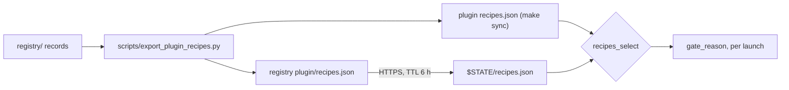

# 15 — Registry and CI

## The registry repository

`0xSero/local-ai-registry` is where recipes are validated and published. It is a Next.js site (the
public registry browser) around a Python curation pipeline, and it ships exactly one artefact this
plugin consumes: **`plugin/recipes.json`**.

| Path | What |
|---|---|
| `registry/` | the records themselves, as JSON: `recipe/`, `hardware/`, `model/`, `model-instance/`, `asset/`, `benchmark/`, `price/`, `speed-sweep/`, `index/`, `schema/` |
| `scripts/` | the pipeline: stdlib-only Python (≥ 3.10), ~40 scripts |
| `plugin/recipes.json` | the published, exported file — the copy the plugin fetches over HTTPS |
| `app/`, `lib/` | the registry site |
| `Makefile` | `check` is what CI runs |

Scripts that matter to this plugin:

| Script | Role |
|---|---|
| `export_plugin_recipes.py` | emits `recipes.json` from the records and stamps `registryCommit`; this is what the plugin's `make sync` runs |
| `check_plugin_gate.py` | runs the **same gate rules** over every validated Docker recipe, so a recipe that the plugin would refuse cannot be published |
| `recommend.py` | keeps exactly one *recommended* recipe per card, by the tier map |
| `validate_rented.py` | rents the exact card, runs the recipe's own image, materialises weights and assets where the plugin would bind-mount them, runs acceptance, promotes |
| `trust.py`, `validate_registry.py` | derive `status` from evidence; refuse drift; referential integrity |
| `format_registry.py`, `curate_registry.py` | canonical form and the index |

The registry's `make check` runs, in order: `format-check`, `validate`, `plugin-gate`, `test`,
`typecheck`, `types-check`, `index-check`, and `python3 -m unittest discover -s scripts -p 'test_*.py'`.
It refuses a working tree where generated files (the index, the generated TypeScript types) differ from
what regeneration produces.

Its CI (`.github/workflows/ci.yml`, on every push and pull request) runs, as separate steps:

| Step | Guards |
|---|---|
| `npm run typecheck`, `npm test` | the site and the records (ajv schema validation of every record) |
| `npm run gen:types` + `git diff --exit-code registry/schema/types.ts` | the generated types match the schemas |
| `python3 scripts/format_registry.py --check` | every registry JSON is canonical |
| `python3 scripts/validate_registry.py`, `check_lil_import.py` | referential integrity and the trust boundary |
| `python3 scripts/check_plugin_gate.py` | the plugin's gate accepts every validated Docker recipe |
| `python3 scripts/test_export_plugin_recipes.py` | the export preserves multi-GPU recipes and context |
| `curate_registry.py --index-only` + `git diff --exit-code registry/index/` + `test ! -f registry/index.json` | the index shards match the records they summarise |
| `npm run build` | the site builds |

The two middle steps are the contract between the repositories: a recipe the plugin's gate would
refuse cannot be published, and the exported file must still carry the multi-card recipes and their
context.

### How the two repositories meet



The plugin's `make sync` is the only writer of its own `recipes.json`:

```make
REGISTRY ?= ../local-ai-registry
sync:
	python3 $(REGISTRY)/scripts/export_plugin_recipes.py --out recipes.json
```

After a sync the stamp moves with the registry, even when no recipe content changed — the two files
differ only in `registryCommit` and `generatedAt` when the registry has moved on without touching
recipes.

## The plugin's CI

### `test.yml` — every push and pull request

```yaml
on: [push, pull_request]
permissions: {contents: read}
jobs.test:
  runs-on: ubuntu-latest
  steps:
    - uses: actions/checkout@08c6903cd8c0fde910a37f88322edcfb5dd907a8   # v5.0.0, pinned by commit
    - run: make test
```

`make test` = `bash test/bundle`, which builds `dist/omarchy-local-ai-<version>.tar.gz`, asserts its
contents are exactly the runtime list, unpacks it and runs both suites against the unpacked copy. No
docker, no GPU, no network: the suite is the shimmed one described in [13 — Tests](13-tests.md). A push
is therefore tested as the shipped artifact, not as a checkout. Actions are pinned by commit SHA, not
by tag.

### `release.yml` — on a `v*` tag

A release is a commit on `main`, a matching version in `manifest.json`, and a `## [X.Y.Z]` section in
`CHANGELOG.md`. The workflow enforces all three:

1. `manifest.json`'s `version` must equal the tag without its `v` — else
   `manifest.json says 5.0.0, tag says 5.0.1`;
2. the tagged commit must be an ancestor of `origin/main` — else `tag is not on main`;
3. `make test` runs again, on the tag;
4. the changelog section for that version is extracted with `awk` and must be non-empty — else
   `no CHANGELOG section for 5.0.1`;
5. `gh release create "$GITHUB_REF_NAME" dist/*.tar.gz --title … --notes-file notes.md --verify-tag`
   — the release attaches the **same archive the suite ran against**, because step 3's `make test` built
   it through `test/bundle`.

Because the marketplace listing targets a **tagged commit**, what a user installs is always a release
the suite passed on. `permissions: contents: write` is what `gh release create` needs.

### `pages.yml` — this wiki

On any change under `wiki/` (or to the workflow itself), and on demand: install `markdown`, run
`wiki/build.py`, fail if it produced no HTML, upload that one generated file as the Pages artifact, and
deploy it to <https://0xsero.github.io/omarchy-local-ai/>. The site is built in CI rather than
committed, so what is published is always the markdown in that commit and no generated file can rot;
`wiki/index.html` is gitignored. Unlike the other workflows this one needs `pages: write` and
`id-token: write`, and its deploy job runs in the `github-pages` environment.

### `traffic.yml` — daily

GitHub keeps clone and view traffic for 14 days, and the referrer/path breakdown as a rolling snapshot
with no daily buckets — none of it is retrievable once it rolls off. Every day at 03:17 UTC (and on
demand) this checks out the **`stats` branch**, writes `traffic/clones.<date>.json`,
`traffic/views.<date>.json`, `traffic/referrers.<date>.json`, `traffic/paths.<date>.json` and
`traffic/repo.<date>.json` from the API, aggregates `traffic/clones-daily.json` and
`traffic/views-daily.json` (one row per day, the newest reading of a day winning, because GitHub
revises the last day or two as data settles) plus `traffic/summary.json`, then pushes to `stats`. It
never touches `main`. It needs `secrets.TRAFFIC_TOKEN` — a token of the repository owner with push
access, because the workflow's own token cannot read the traffic API.

`traffic/summary.json` is the whole count in one file: stars, forks, watchers and open issues, clone
and view totals with each series' peak day and rolling 14-day uniques, and the current referrer and
path breakdowns. Only `uniques_14d` counts *people*: `daily_uniques_sum` adds a cloner once per day
they cloned, so it overcounts anyone who cloned twice. Every `omarchy plugin add` is a clone, so
`clones` is the closest thing to an install count — not the release assets, which are the suite's own
archive and no one's download channel.

## Versioning

Semver, in `manifest.json`, with the changes described in `CHANGELOG.md`:

| Bump | For |
|---|---|
| patch | fixes |
| minor | behaviour |
| major | a change to what the card does, or to the state files |

State-format versions are separate and explicit: `omarchy-local-ai/ledger/2`,
`omarchy-local-ai/snapshot/10`, `omarchy-local-ai/recipes/1`. A snapshot schema change is a
breaking change for anything reading `snapshot.json` (the panel, scripts, `test/ui.cjs`), so the
number moves with it — 5.0.0 shipped snapshot 10 alongside the multi-model ledger 2.

## `make check` in this repository

```make
check: test
	jq -e '.schemaVersion=="omarchy-local-ai/recipes/1"
	       and (.registryCommit|test("^[0-9a-f]{40}$"))
	       and (.gateway.image|test("@sha256:[0-9a-f]{64}$"))
	       and (.hardware|length>0)' recipes.json
```

It asserts the file's schema version, that the stamp looks like a commit, that the gateway image is
digest-pinned, and that there is at least one hardware entry. The stricter relationship — that the
file is exactly what the registry exports at the commit it names — is the registry's own test suite's
job, since only the registry can regenerate it.